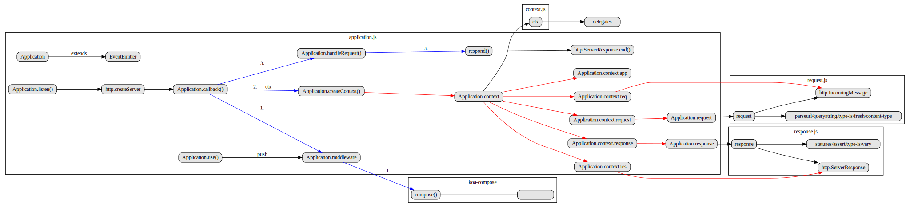

  [![gitter][gitter-image]][gitter-url]
  [![NPM version][npm-image]][npm-url]
  [![build status][travis-image]][travis-url]
  [![Test coverage][coveralls-image]][coveralls-url]
  [![OpenCollective Backers][backers-image]](#backers)
  [![OpenCollective Sponsors][sponsors-image]](#sponsors)
  [![PR's Welcome][pr-welcoming-image]][pr-welcoming-url]

  Expressive HTTP middleware framework for node.js to make web applications and APIs more enjoyable to write. Koa's middleware stack flows in a stack-like manner, allowing you to perform actions downstream then filter and manipulate the response upstream.

  Only methods that are common to nearly all HTTP servers are integrated directly into Koa's small ~570 SLOC codebase. This
  includes things like content negotiation, normalization of node inconsistencies, redirection, and a few others.

  Koa is not bundled with any middleware.

## 模块依赖

模块依赖参考：[npmgraph](http://npm.broofa.com/?q=koa)


## 目录结构

``` bash
├── application.js - 入口文件，封装app.***
├── context.js - ctx对象，处理中间件和包装
├── request.js - ctx.request对象
└── response.js - ctx.response对象
```

## 执行流程



application.js为入口文件。

application对象继承于原生event模块的EventEmitter。

当我们使用app.use时，其实是给app.middleware中间件列表中增加中间件函数。

在app.listen时，调用了app.callback函数，执行了以下几步：

1、合并中间件

通过koa-compose模块，对中间件列表进行合并处理。该模块也是koa的中间件引擎部分。

2、创建ctx对象

通过app.createContext方法创建ctx对象，其中app.context来自context.js文件，底层通过delegates模块将request，response的一些属性原型指向，从而实现别名挂载。app.context.req和app.context.res分别来自原生http模块的IncomingMessage和ServerResponse，并在其上层封装了app.context.request和app.context.response。

3、处理响应

通过app.handleRequest方法处理响应，底层基于ServerResponse.end方法。

至于request和response文件，很多底层属性的封装基于第三方模块，这些选型和express非常类似，这里就不一一描述了。可以参考[express源码解析](https://github.com/FunnyLiu/express/tree/readsource#%E6%89%A7%E8%A1%8C%E6%B5%81%E7%A8%8B)

---

## 核心第三方模块

除了koa源码，一些核心模块的源码也是值得一读的，有助于我们理解整个web应用。

### koa-compose

[源码解读](https://github.com/FunnyLiu/compose/tree/readsource)

该模块是koa中间件和核心引擎，作用是将多个中间件合并，在源码中，所有通过use堆积的中间件列表，最后都会通过该方法来处理。

### koa-logger

[源码解读](https://github.com/FunnyLiu/logger/tree/readsource)

核心就是通过洋葱模型，在前半阶段拦截request，在后半阶段通过http.ServerResponse的finish和close事件判断响应结束，拦截响应。

### koa-static

[源码解读](https://github.com/FunnyLiu/static/tree/readsource)

通过defer参数来决定next的执行位置，从而决定该中间件的执行时机。

然后底层基于koa-send模块的完成真正的静态资源文件服务逻辑。

### koa-send

[源码解读](https://github.com/FunnyLiu/send/tree/readsource)

分析出指向的文件的具体文件路径，然后进行content-encoding压缩。

最后通过fs.createReadStream将文件以可读流的方式，挂载在ctx.body上，交给koa最后去res.end。

### koa-views

[源码解读](https://github.com/FunnyLiu/koa-views/tree/readsource)

提供一个render方法挂载到ctx和ctx.response上。

该方法基于getPaths模块，通过模板获取到真实路径。然后如果是html文件，则直接通过koa-send模块进行静态文件处理方式。koa-send底层通过读取文件可读流的方式，将内存挂载到ctx.body上。

如果是模板文件，则通过consolidate模块获取对应模板的render方法，拼接为html后，挂载到ctx.body上。


### koa-bodyparser

[源码解读](https://github.com/FunnyLiu/bodyparser/tree/readsource)

本身封装了一个中间件，使用co-body对请求内容进行解析，将解析后的值挂载在ctx.request.body上。 co-body本身是基于raw-body来完成具体的操作，这和express依赖的body-parser是一致的。


### koa-router

[源码解读](https://github.com/FunnyLiu/koa-router/tree/readsource)

相比express的Router/Layer/Route模型。koa-router只有Router/Layer。

Layer用来负责通过path的各种methods的中间件，Router则是不同path的。

各个方法底层都是通过Router.register()对路由和中间件方法注册，最后暴露的中间件函数的通过Router.routes()来完成。

将所有的中间件基于koa-compose合并为洋葱模型，对外暴露。

### koa-error 

[源码解读](https://github.com/FunnyLiu/error/tree/readsource)

利用try-catch，配合koa的洋葱模型，在最外层使用该中间件，即可达到异常捕获效果。

通过ctx.accepts类型的不同，采用不同的处理方法。

### koa-onerror 

[源码分析](https://github.com/FunnyLiu/onerror/tree/readsource)

和koa-error使用try-catch的思路不同，这里采用hack了ctx.onerror方法的方式来处理异常。这样就可以处理 steams和and event的errors，并且提供了更加灵活的配置参数。


## Installation

Koa requires __node v7.6.0__ or higher for ES2015 and async function support.

```
$ npm install koa
```

## Hello Koa

```js
const Koa = require('koa');
const app = new Koa();

// response
app.use(ctx => {
  ctx.body = 'Hello Koa';
});

app.listen(3000);
```

## Getting started

 - [Kick-Off-Koa](https://github.com/koajs/kick-off-koa) - An intro to Koa via a set of self-guided workshops.
 - [Workshop](https://github.com/koajs/workshop) - A workshop to learn the basics of Koa, Express' spiritual successor.
 - [Introduction Screencast](http://knowthen.com/episode-3-koajs-quickstart-guide/) - An introduction to installing and getting started with Koa


## Middleware

Koa is a middleware framework that can take two different kinds of functions as middleware:

  * async function
  * common function

Here is an example of logger middleware with each of the different functions:

### ___async___ functions (node v7.6+)

```js
app.use(async (ctx, next) => {
  const start = Date.now();
  await next();
  const ms = Date.now() - start;
  console.log(`${ctx.method} ${ctx.url} - ${ms}ms`);
});
```

### Common function

```js
// Middleware normally takes two parameters (ctx, next), ctx is the context for one request,
// next is a function that is invoked to execute the downstream middleware. It returns a Promise with a then function for running code after completion.

app.use((ctx, next) => {
  const start = Date.now();
  return next().then(() => {
    const ms = Date.now() - start;
    console.log(`${ctx.method} ${ctx.url} - ${ms}ms`);
  });
});
```

### Koa v1.x Middleware Signature

The middleware signature changed between v1.x and v2.x.  The older signature is deprecated.

**Old signature middleware support will be removed in v3**

Please see the [Migration Guide](docs/migration.md) for more information on upgrading from v1.x and
using v1.x middleware with v2.x.

## Context, Request and Response

Each middleware receives a Koa `Context` object that encapsulates an incoming
http message and the corresponding response to that message.  `ctx` is often used
as the parameter name for the context object.

```js
app.use(async (ctx, next) => { await next(); });
```

Koa provides a `Request` object as the `request` property of the `Context`.  
Koa's `Request` object provides helpful methods for working with
http requests which delegate to an [IncomingMessage](https://nodejs.org/api/http.html#http_class_http_incomingmessage)
from the node `http` module.

Here is an example of checking that a requesting client supports xml.

```js
app.use(async (ctx, next) => {
  ctx.assert(ctx.request.accepts('xml'), 406);
  // equivalent to:
  // if (!ctx.request.accepts('xml')) ctx.throw(406);
  await next();
});
```

Koa provides a `Response` object as the `response` property of the `Context`.  
Koa's `Response` object provides helpful methods for working with
http responses which delegate to a [ServerResponse](https://nodejs.org/api/http.html#http_class_http_serverresponse)
.  

Koa's pattern of delegating to Node's request and response objects rather than extending them
provides a cleaner interface and reduces conflicts between different middleware and with Node
itself as well as providing better support for stream handling.  The `IncomingMessage` can still be
directly accessed as the `req` property on the `Context` and `ServerResponse` can be directly
accessed as the `res` property on the `Context`.

Here is an example using Koa's `Response` object to stream a file as the response body.

```js
app.use(async (ctx, next) => {
  await next();
  ctx.response.type = 'xml';
  ctx.response.body = fs.createReadStream('really_large.xml');
});
```

The `Context` object also provides shortcuts for methods on its `request` and `response`.  In the prior
examples,  `ctx.type` can be used instead of `ctx.response.type` and `ctx.accepts` can be used
instead of `ctx.request.accepts`.

For more information on `Request`, `Response` and `Context`, see the [Request API Reference](docs/api/request.md),
[Response API Reference](docs/api/response.md) and [Context API Reference](docs/api/context.md).

## Koa Application

The object created when executing `new Koa()` is known as the Koa application object.

The application object is Koa's interface with node's http server and handles the registration
of middleware, dispatching to the middleware from http, default error handling, as well as
configuration of the context, request and response objects.

Learn more about the application object in the [Application API Reference](docs/api/index.md).

## Documentation

 - [Usage Guide](docs/guide.md)
 - [Error Handling](docs/error-handling.md)
 - [Koa for Express Users](docs/koa-vs-express.md)
 - [FAQ](docs/faq.md)
 - [API documentation](docs/api/index.md)

## Babel setup

If you're not using `node v7.6+`, we recommend setting up `babel` with [`@babel/preset-env`](https://babeljs.io/docs/en/next/babel-preset-env):

```bash
$ npm install @babel/register @babel/preset-env @babel/cli --save-dev
```

In development, you'll want to use [`@babel/register`](https://babeljs.io/docs/en/next/babel-register):

```bash
node --require @babel/register <your-entry-file>
```

In production, you'll want to build your files with [`@babel/cli`](https://babeljs.io/docs/en/babel-cli). Suppose you are compiling a folder `src` and you wanted the output to go to a new folder `dist` with non-javascript files copied:

```bash
babel src --out-dir dist --copy-files
```

And have your `.babelrc` setup:

```json
{
  "presets": [
    ["@babel/preset-env", {
      "targets": {
        "node": true
      }
    }]
  ]
}
```

## Troubleshooting

Check the [Troubleshooting Guide](docs/troubleshooting.md) or [Debugging Koa](docs/guide.md#debugging-koa) in
the general Koa guide.

## Running tests

```
$ npm test
```

## Reporting vulnerabilities

To report a security vulnerability, please do not open an issue, as this notifies attackers
of the vulnerability. Instead, please email [dead_horse](mailto:heyiyu.deadhorse@gmail.com) and [jonathanong](mailto:me@jongleberry.com) to
disclose.

## Authors

See [AUTHORS](AUTHORS).

## Community

 - [Badgeboard](https://koajs.github.io/badgeboard) and list of official modules
 - [Examples](https://github.com/koajs/examples)
 - [Middleware](https://github.com/koajs/koa/wiki) list
 - [Wiki](https://github.com/koajs/koa/wiki)
 - [G+ Community](https://plus.google.com/communities/101845768320796750641)
 - [Reddit Community](https://www.reddit.com/r/koajs)
 - [Mailing list](https://groups.google.com/forum/#!forum/koajs)
 - [中文文档 v1.x](https://github.com/guo-yu/koa-guide)
 - [中文文档 v2.x](https://github.com/demopark/koa-docs-Zh-CN)
 - __[#koajs]__ on freenode

## Job Board

Looking for a career upgrade?

<a href="https://astro.netlify.com/automattic"></a>
<a href="https://astro.netlify.com/segment"></a>
<a href="https://astro.netlify.com/auth0"></a>

## Backers

Support us with a monthly donation and help us continue our activities.

<a href="https://opencollective.com/koajs/backer/0/website" target="_blank"></a>
<a href="https://opencollective.com/koajs/backer/1/website" target="_blank"></a>
<a href="https://opencollective.com/koajs/backer/2/website" target="_blank"></a>
<a href="https://opencollective.com/koajs/backer/3/website" target="_blank"></a>
<a href="https://opencollective.com/koajs/backer/4/website" target="_blank"></a>
<a href="https://opencollective.com/koajs/backer/5/website" target="_blank"></a>
<a href="https://opencollective.com/koajs/backer/6/website" target="_blank"></a>
<a href="https://opencollective.com/koajs/backer/7/website" target="_blank"></a>
<a href="https://opencollective.com/koajs/backer/8/website" target="_blank"></a>
<a href="https://opencollective.com/koajs/backer/9/website" target="_blank"></a>
<a href="https://opencollective.com/koajs/backer/10/website" target="_blank"></a>
<a href="https://opencollective.com/koajs/backer/11/website" target="_blank"></a>
<a href="https://opencollective.com/koajs/backer/12/website" target="_blank"></a>
<a href="https://opencollective.com/koajs/backer/13/website" target="_blank"></a>
<a href="https://opencollective.com/koajs/backer/14/website" target="_blank"></a>
<a href="https://opencollective.com/koajs/backer/15/website" target="_blank"></a>
<a href="https://opencollective.com/koajs/backer/16/website" target="_blank"></a>
<a href="https://opencollective.com/koajs/backer/17/website" target="_blank"></a>
<a href="https://opencollective.com/koajs/backer/18/website" target="_blank"></a>
<a href="https://opencollective.com/koajs/backer/19/website" target="_blank"></a>
<a href="https://opencollective.com/koajs/backer/20/website" target="_blank"></a>
<a href="https://opencollective.com/koajs/backer/21/website" target="_blank"></a>
<a href="https://opencollective.com/koajs/backer/22/website" target="_blank"></a>
<a href="https://opencollective.com/koajs/backer/23/website" target="_blank"></a>
<a href="https://opencollective.com/koajs/backer/24/website" target="_blank"></a>
<a href="https://opencollective.com/koajs/backer/25/website" target="_blank"></a>
<a href="https://opencollective.com/koajs/backer/26/website" target="_blank"></a>
<a href="https://opencollective.com/koajs/backer/27/website" target="_blank"></a>
<a href="https://opencollective.com/koajs/backer/28/website" target="_blank"></a>
<a href="https://opencollective.com/koajs/backer/29/website" target="_blank"></a>


## Sponsors

Become a sponsor and get your logo on our README on Github with a link to your site.

<a href="https://opencollective.com/koajs/sponsor/0/website" target="_blank"></a>
<a href="https://opencollective.com/koajs/sponsor/1/website" target="_blank"></a>
<a href="https://opencollective.com/koajs/sponsor/2/website" target="_blank"></a>
<a href="https://opencollective.com/koajs/sponsor/3/website" target="_blank"></a>
<a href="https://opencollective.com/koajs/sponsor/4/website" target="_blank"></a>
<a href="https://opencollective.com/koajs/sponsor/5/website" target="_blank"></a>
<a href="https://opencollective.com/koajs/sponsor/6/website" target="_blank"></a>
<a href="https://opencollective.com/koajs/sponsor/7/website" target="_blank"></a>
<a href="https://opencollective.com/koajs/sponsor/8/website" target="_blank"></a>
<a href="https://opencollective.com/koajs/sponsor/9/website" target="_blank"></a>
<a href="https://opencollective.com/koajs/sponsor/10/website" target="_blank"></a>
<a href="https://opencollective.com/koajs/sponsor/11/website" target="_blank"></a>
<a href="https://opencollective.com/koajs/sponsor/12/website" target="_blank"></a>
<a href="https://opencollective.com/koajs/sponsor/13/website" target="_blank"></a>
<a href="https://opencollective.com/koajs/sponsor/14/website" target="_blank"></a>
<a href="https://opencollective.com/koajs/sponsor/15/website" target="_blank"></a>
<a href="https://opencollective.com/koajs/sponsor/16/website" target="_blank"></a>
<a href="https://opencollective.com/koajs/sponsor/17/website" target="_blank"></a>
<a href="https://opencollective.com/koajs/sponsor/18/website" target="_blank"></a>
<a href="https://opencollective.com/koajs/sponsor/19/website" target="_blank"></a>
<a href="https://opencollective.com/koajs/sponsor/20/website" target="_blank"></a>
<a href="https://opencollective.com/koajs/sponsor/21/website" target="_blank"></a>
<a href="https://opencollective.com/koajs/sponsor/22/website" target="_blank"></a>
<a href="https://opencollective.com/koajs/sponsor/23/website" target="_blank"></a>
<a href="https://opencollective.com/koajs/sponsor/24/website" target="_blank"></a>
<a href="https://opencollective.com/koajs/sponsor/25/website" target="_blank"></a>
<a href="https://opencollective.com/koajs/sponsor/26/website" target="_blank"></a>
<a href="https://opencollective.com/koajs/sponsor/27/website" target="_blank"></a>
<a href="https://opencollective.com/koajs/sponsor/28/website" target="_blank"></a>
<a href="https://opencollective.com/koajs/sponsor/29/website" target="_blank"></a>

# License

  [MIT](https://github.com/koajs/koa/blob/master/LICENSE)

[npm-image]: https://img.shields.io/npm/v/koa.svg?style=flat-square
[npm-url]: https://www.npmjs.com/package/koa
[travis-image]: https://img.shields.io/travis/koajs/koa/master.svg?style=flat-square
[travis-url]: https://travis-ci.org/koajs/koa
[coveralls-image]: https://img.shields.io/codecov/c/github/koajs/koa.svg?style=flat-square
[coveralls-url]: https://codecov.io/github/koajs/koa?branch=master
[backers-image]: https://opencollective.com/koajs/backers/badge.svg?style=flat-square
[sponsors-image]: https://opencollective.com/koajs/sponsors/badge.svg?style=flat-square
[gitter-image]: https://img.shields.io/gitter/room/koajs/koa.svg?style=flat-square
[gitter-url]: https://gitter.im/koajs/koa?utm_source=badge&utm_medium=badge&utm_campaign=pr-badge&utm_content=badge
[#koajs]: https://webchat.freenode.net/?channels=#koajs
[pr-welcoming-image]: https://img.shields.io/badge/PRs-welcome-brightgreen.svg?style=flat-square
[pr-welcoming-url]: https://github.com/koajs/koa/pull/new
